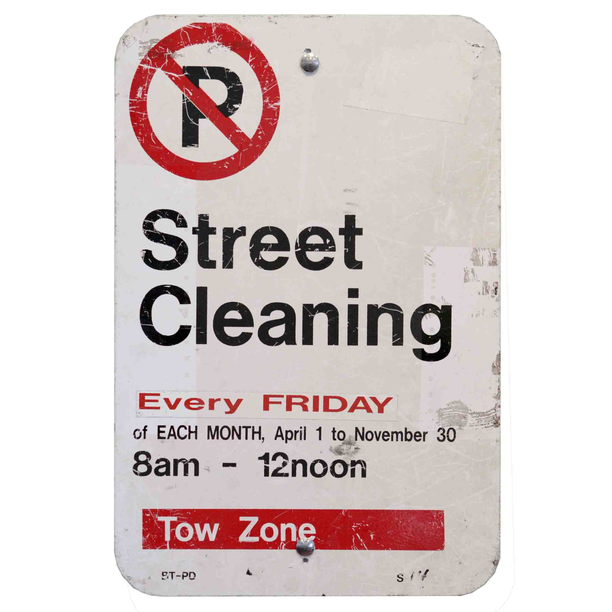
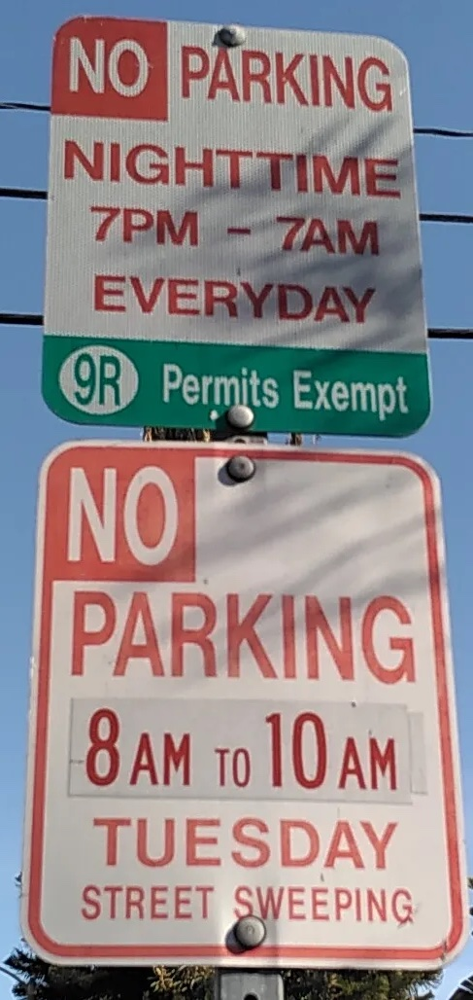
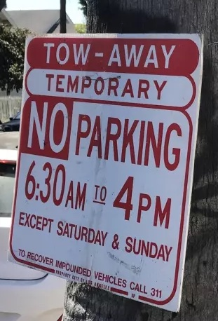
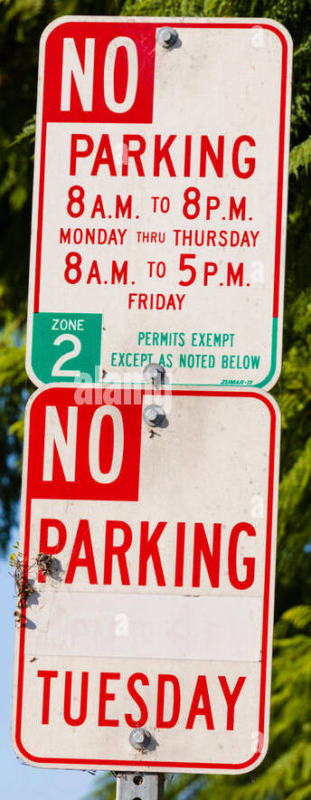

# Parking Rules

In this exercise, you will write a program that determines whether street parking is allowed, according to posted signs.

## What to Do

1. With your partner, edit the source files in VS Code: `parking.cc`, `parking_functions.h`, `parking_functions.cc`, and `parking_unittest.cc`. Add the required headers and replace all the TODO comments with working code.
1. Compile your program with the `$ make` shell command. Use the **debug compile error** procedure to debug any compile errors.
1. Run your program with the `$ ./parking` shell command.
1. Test that your program passes all of the test cases in the test suite below. If your program suffers a runtime error, use the **debug runtime error** procedure to debug the error. If your program does not produce the expected output, use the **debug logic error** procedure to debug the error.
1. Test your program against automated unit tests with the `$ make unittest` command. Debug any runtime errors or logic errors using the same procedures.
1. Test your program against automated black box tests with the `$ make test` command. Debug any errors.
1. Check your header with the `$ make header` shell command. Correct any errors.
1. Check for format errors with the `$ make format` shell command. Correct any errors.
1. Check for lint errors with the `$ make lint` shell command. Correct any errors.
1. After your program passes all of these tests and checks, push your code to GitHub. Use the usual trio of commands: `git add`, `git commit`, and `git push`.

## Parking Rules

As you may know, some city streets allow cars to park alongside at all times, while other streets have signs that restrict when parking is allowed.
Parking may be restricted to make way for street sweeping, landscaping, farmers markets, and other civic routines.
Sometimes there can be multiple signs that make for complicated rules.

In this exercise you will write functions that implement the parking restriction rules on signs.
This code could be used in a system that automates parking rules, such as an app that tells you where you are allowed to park,
or an app that parking enforcement officers use to issue parking tickets.

Our city has five streets, all named after trees: Ash Street, Beech Street, Cedar Street, Date Street, and Elm Street.
Each street has a different parking sign.
The parking rules depend on:
- The day of the week, Monday through Sunday;
- the hour, 12 AM (midnight) through 11 PM;
- and on Date street, the minute within the hour, 0:00 through 0:59.

For each street, you will write a function that decides whether parking is allowed, or not allowed, at a specific time.

### Ash Street


### Beech Street



Ignore the part of the sign that says "April 1 to November 30".
Your function should assume that all of the rules on the sign are in effect.

### Cedar Street



Ignore the part of the sign that says "9R Permits Exempt."
Your function should assume that the car does not have any permit, so all of the rules on the sign are in effect.

### Date Street



### Elm Street



Ignore the part of the sign that says "zone 2 permits exempt."
Your function should assume that the car does not have any permit, so all of the rules on the sign are in effect.

## Input Ranges

We represent a **street name** as a string using the full name of the street using lower case, so:

| Street | Input String |
|--------|--------------|
| Ash Street | "ash" |
| Beech Street | "beech" |
| Cedar Street | "cedar" |
| Date Street | "date" |
| Elm Street | "elm" |

To be valid, a street string must be one of the five specific values above. Any other string is invalid.

We represent a **day of the week** as a string using the first three letters in
lower case, so:

| Day       | Input String |
|-----------|-------|
| Monday    | "mon" |
| Tuesday   | "tue" |
| Wednesday | "wed" |
| Thursday  | "thu" |
| Friday    | "fri" |
| Saturday  | "sat" |
| Sunday    | "sun" |

To be valid, a day string must be one of the seven specific values above. Any other string is invalid.

We represent a **time** using the 24-hour clock, otherwise known as military time. See some examples below:

| Written Time of Day | Input Hour | Input Minute |
|---------------------|------------|--------------|
| 6:23 AM             | 6          | 23           |
| 7:00 AM             | 7          | 0            |
| 7:59 AM             | 7          | 59           |
| 12 noon             | 12         | 0            |
| 12:01 PM            | 12         | 1            |
| 1:00 PM             | 13         | 0            |
| 9:00 PM             | 21         | 0            |
| 11:59 PM            | 23         | 59           |
| 12 midnight         | 0          | 0            |

To be valid, an hour number must be between 0 and 23, and a minute number must be between 0 and 59.

## Restriction Rules End At :59

It is debatable whether the rule "no parking from 7 AM to 10 AM" makes parking disallowed
through 9:59 AM, or through 10:00 AM. To keep things simple, we assume that a parking
restriction ends at minute 59. So "no parking from 7 AM to 10 AM" disallows parking from
7:00 AM through 9:59 AM; starting at 10:00 AM, parking is allowed again.

This policy means that your Boolean expressions can determine whether a restriction has
ended by using only the hour number. The minute number does not need to be involved.
For example, the "no parking from 7 AM to 10 AM" rule disallows parking when the hour
is 7, 8, or 9.

Date Street's rule is unusual because it starts at 6:30 AM, not a minute 0. That means
that the minute number factors into when the restriction *starts.* However,
the rule ends at 4 PM, so the minute number does not factor into when the restriciton *ends.* 

## Input Validation

Your program must take four command line arguments:
1. street
1. day
1. hour
1. minute

Your program should validate the command line arguments.

If the number of arguments is wrong, your program should print the error message
```
error: you must supply four arguments
```
and return a non-zero exit code.

If the street string is invalid, your program should print the error message
```
error: invalid street
```
and return a non-zero exit code.

If the day string is invalid, your program should print the error message
```
error: invalid day
```
and return a non-zero exit code.

If the hour number is invalid, your program should print the error message
```
error: invalid hour
```
and return a non-zero exit code.

If the minute number is invalid, your program should print the error message
```
error: invalid minute
```
and return a non-zero exit code.

Your program must not suffer a runtime error in these situations.

Your program does not need to validate that the hour and minute arguments represent integers. In particular, you do not need to write a try-catch block.

## Functions

As usual, the prompt code has several functions that you need to complete.

### `CanParkOnAsh`

```C++
// Returns true if parking is allowed on Ash street at the given time, or
// false otherwise.
//
// The sign on Ash street reads:
// NO PARKING 10AM TO 12PM WEDNESDAY STREET SWEEPING
//
// day must be the name of a day of the week, using the first three letters in
// lower case, so one of: "mon", "tue", "wed", "thu", "fri", "sat", or "sun".
//
// hour must be the hour number using 24-hour notation (military time),
// so 7 means 7 AM and 19 means 7 PM.
bool CanParkOnAsh(const std::string& day, int hour);
```

### `CanParkOnBeech`

```C++
// Returns true if parking is allowed on Beech street at the given time, or
// false otherwise.
//
// The sign on Beech street reads:
// Street Cleaning Every Friday of EACH MONTH, 8 am - 12 noon
//
// day must be the name of a day of the week, using the first three letters in
// lower case, so one of: "mon", "tue", "wed", "thu", "fri", "sat", or "sun".
//
// hour must be the hour number using 24-hour notation (military time),
// so 7 means 7 AM and 19 means 7 PM.
bool CanParkOnBeech(const std::string& day, int hour);
```

### `CanParkOnCedar`

```C++
// Returns true if parking is allowed on Cedar street at the given time, or
// false otherwise.
//
// The signs on Cedar street read:
// NO PARKING NIGHTTIME 7PM - 7AM EVERYDAY
// NO PARKING 8 AM to 10 AM TUESDAY STREET SWEEPING
//
// day must be the name of a day of the week, using the first three letters in
// lower case, so one of: "mon", "tue", "wed", "thu", "fri", "sat", or "sun".
//
// hour must be the hour number using 24-hour notation (military time),
// so 7 means 7 AM and 19 means 7 PM.
bool CanParkOnCedar(const std::string& day, int hour);
```

### `CanParkOnDate`

```C++
// Returns true if parking is allowed on Date street at the given time, or
// false otherwise.
//
// The signs on Date street read:
// NO PARKING 6:30 AM TO 4 PM EXCEPT SATURDAY & SUNDAY
//
// day must be the name of a day of the week, using the first three letters in
// lower case, so one of: "mon", "tue", "wed", "thu", "fri", "sat", or "sun".
//
// hour must be the hour number using 24-hour notation (military time),
// so 7 means 7 AM and 19 means 7 PM.
//
// minute must be the minute number, 0 through 59, so at 3:25 PM, minute
// would be 25.
bool CanParkOnDate(const std::string& day, int hour, int minute);
```

### `CanParkOnElm`

```C++
// Returns true if parking is allowed on Elm street at the given time, or
// false otherwise.
//
// The signs on Elm street read:
// NO PARKING
// 8 AM TO 8 PM
// MONDAY THRU THURSDAY
// 8 AM TO 5 PM
// FRIDAY
//
// NO PARKING TUESDAY
//
// day must be the name of a day of the week, using the first three letters in
// lower case, so one of: "mon", "tue", "wed", "thu", "fri", "sat", or "sun".
//
// hour must be the hour number using 24-hour notation (military time),
// so 7 means 7 AM and 19 means 7 PM.
bool CanParkOnElm(const std::string& day, int hour);
```

### `main`

As usual, you need to complete the program's `main` function.

This program's `main` needs to
1. validate the number of arguments (should be four);
1. validate the value of each argument (as described above);
1. decide which function to call, based on the street name;
1. call that function to determine whether parking is allowed; and
1. print "allowed" or "not allowed", on its own line, accordingly.

## Example Input and Output

```
$ ./parking
error: you must supply four arguments
```

```
$ ./parking a b c d e
error: you must supply four arguments
```

```
$ ./parking main wed 11 0
error: invalid street
```

```
$ ./parking ash yesterday 11 0
error: invalid day
```

```
$ ./parking ash mon -1 0
error: invalid hour
```

```
$ ./parking ash mon 25 0
error: invalid hour
```

```
$ ./parking ash mon 11 -1
error: invalid minute
```

```
$ ./parking ash mon 11 60
error: invalid minute
```

```
$ ./parking ash mon 11 0
allowed
```

```
$ ./parking ash mon 11 0
allowed
```

## Test Cases

As usual, test your program against the test suite below.

| Test Case | Input                              | Expected Output                          |
|-----------|------------------------------------|------------------------------------------|
| 1         | (no arguments)      | `error: you must supply four arguments` |
| 2         | a b c d e | `error: you must supply four arguments` |
| 3         | main wed 11 0 | `error: invalid street` |
| 4         | ash yesterday 11 0 | `error: invalid day` |
| 5         | ash mon -1 0 | `error: invalid hour` |
| 5         | ash mon 25 0 | `error: invalid hour` |
| 6         | ash mon 11 -1 | `error: invalid minute` |
| 7         | ash mon 11 60 | `error: invalid minute` |
| 8         | ash mon 11 0 | `allowed` |
| 9         | ash wed 11 0 | `not allowed` |
| 10        | beech thu 8 30 | `allowed` |
| 11        | beech fri 8 30 | `not allowed` |
| 12        | cedar mon 13 20 | `allowed` |
| 13        | cedar tue 1 40 | `not allowed` |
| 14        | cedar tue 9 400 | `not allowed` |
| 15        | date sat 14 0 | `allowed` |
| 16        | date sun 15 0 | `allowed` |
| 17        | date mon 14 30 | `not allowed` |
| 18        | elm fri 18 0 | `allowed` |
| 19        | elm fri 16 30 | `not allowed` |

## Next Steps

After you have pushed your code, you are done with this lab. You may ask your TA for permission to sign out and leave.
